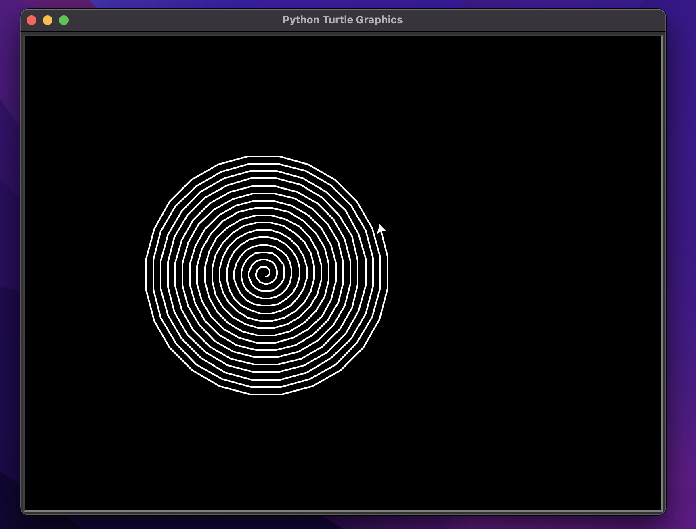

## Faculdade Unisociesc
Prof. Esp. Randerson Melville  
Disciplina: Computação Gráfica e Realidade Virtual  
Projetos com Biblioteca Turtle do Python  
> Data de entrega: 05/04/2024

## Resultado:

## Como enviar a solução

1. Clone este repositório para o seu ambiente de desenvolvimento local:
2. Escreva sua solução para o problema no arquivo Python correspondente.
4. Teste sua solução localmente para garantir que funcione conforme esperado.
5. Submeta sua solução como um pull request:

## Divisão de grupos e projetos

+ Grupo 1: Desenho de uma Casa com Jardim
+ Grupo 2: Labirinto Animado
+ Grupo 3: Arco-Íris em Movimento
+ Grupo 4: Estrelas Cadentes
+ Grupo 5: Espiral em 3D
+ Grupo 6: Pintura com Texturas
+ Grupo 7: Círculos Concêntricos em Movimento
+ Grupo 8: Desenho de um Fractal
+ Grupo 9: Borboletas Voando
+ Grupo 10: Sombra de um Objeto em Movimento

## Projetos

1. **Desenho de uma Casa com Jardim:**
   - Desenhe uma cena encantadora com uma casa, jardim e elementos naturais usando formas simples como retângulos, triângulos e círculos.

2. **Labirinto Animado:**
   - Crie um labirinto intrigante e programe uma tartaruga para explorá-lo, deixando um rastro enquanto se move.

3. **Arco-Íris em Movimento:**
   - Desenhe um arco-íris em movimento com cores que mudam gradualmente ao longo do tempo.

4. **Estrelas Cadentes:**
   - Anime estrelas cadentes cruzando o céu noturno, desaparecendo à medida que se movem.

5. **Espiral em 3D:**
   - Desenhe uma espiral tridimensional que parece se projetar para fora da tela.

6. **Pintura com Texturas:**
   - Adicione texturas detalhadas a uma paisagem de sua escolha para criar uma cena visualmente rica.

7. **Círculos Concêntricos em Movimento:**
   - Crie uma animação de círculos concêntricos em movimento, mudando de tamanho e cor.

8. **Desenho de um Fractal:**
   - Explore os padrões infinitamente complexos dos fractais usando recursão.

9. **Borboletas Voando:**
   - Anime borboletas voando pela tela em padrões aleatórios, enchendo o ar com cores vibrantes.

10. **Sombra de um Objeto em Movimento:**
    - Crie uma animação de um objeto em movimento acompanhado por uma sombra dinâmica.
---
